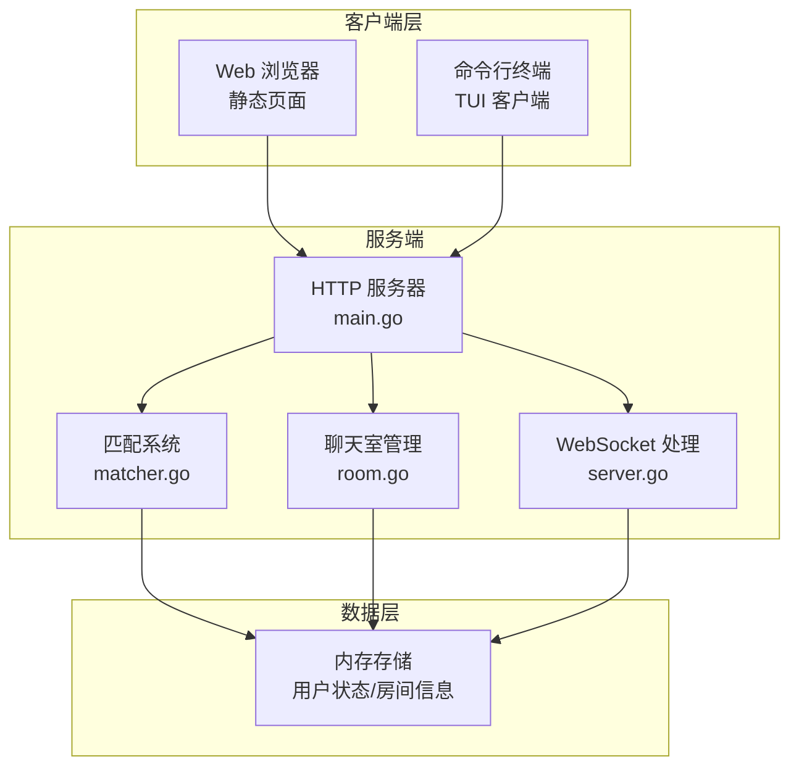

# Chat Matcher 🚀

[](https://golang.org/)
[](https://github.com/gorilla/websocket)
[](LICENSE)

一个基于 WebSocket 的简易实时聊天匹配系统，支持用户随机匹配和实时通信。

## 📋 目录

- [项目介绍](#项目介绍)
- [功能特性](#功能特性)
- [技术栈](#技术栈)
- [系统架构](#系统架构)
- [快速开始](#快速开始)
- [使用方法](#使用方法)
- [API文档](#api文档)
- [项目结构](#项目结构)
- [开发指南](#开发指南)
- [贡献指南](#贡献指南)
- [许可证](#许可证)

## 🎯 项目介绍

Chat Matcher 是一个高性能的实时聊天匹配系统，旨在为用户提供快速匹配和流畅的聊天体验。项目采用 Go 语言开发，使用 WebSocket 技术实现双向实时通信，支持 Web 和命令行两种客户端。

### 核心特点

- 🔄 **智能匹配**: 基于队列的随机匹配算法
- 💬 **实时通信**: WebSocket 双向通信，低延迟消息传递
- 🎨 **多端支持**: 支持 Web 浏览器和命令行终端
- 🏠 **房间管理**: 自动创建和管理聊天房间
- 🔒 **状态管理**: 完整的用户状态跟踪和管理

## ✨ 功能特性

### 核心功能

- **用户匹配**
  - 随机匹配算法
  - 智能队列管理
  - 防止自我匹配
  - 匹配失败重试机制

- **实时聊天**
  - WebSocket 双向通信
  - 实时消息传递
  - 多媒体消息支持（文本/图片/音频/视频）
  - 消息广播机制

- **房间管理**
  - 自动房间创建
  - 用户加入/退出处理
  - 房间生命周期管理
  - 并发安全控制

- **用户界面**
  - 现代化 Web 界面
  - 响应式设计
  - 优雅的命令行界面（TUI）
  - 实时状态显示

## 🛠 技术栈

### 后端
- **语言**: Go 1.24.6
- **WebSocket**: Gorilla WebSocket v1.5.3
- **HTTP**: 标准库 net/http
- **并发**: Goroutines + Mutex

### 前端
- **Web**: 原生 HTML5 + CSS3 + JavaScript
- **CLI**: Bubble Tea TUI 框架
- **样式**: Lip Gloss 样式库

### 依赖管理
- **模块**: Go Modules
- **主要依赖**:
  - `github.com/gorilla/websocket` - WebSocket 支持
  - `github.com/charmbracelet/bubbletea` - 终端 UI 框架
  - `github.com/charmbracelet/lipgloss` - 终端样式库
  - `github.com/charmbracelet/bubbles` - 终端组件库

## 🏗 系统架构



### 核心组件

- **main.go**: 程序入口，HTTP 路由配置
- **handler/server.go**: HTTP 和 WebSocket 请求处理
- **handler/matcher.go**: 用户匹配逻辑实现
- **handler/room.go**: 聊天室管理和消息广播
- **handler/types.go**: 数据结构定义
- **static/index.html**: Web 客户端界面
- **cli/main.go**: 命令行客户端实现

## 🚀 快速开始

### 环境要求

- Go 1.24.6 或更高版本
- 现代浏览器（支持 WebSocket）
- 终端（用于 CLI 客户端）

### 安装步骤

1. **克隆项目**
```bash
git clone https://github.com/toujourser/chat-matcher.git
cd chat-matcher
```

2. **安装依赖**
```bash
go mod download
```

3. **启动服务器**
```bash
go run main.go
```

服务器将在 `http://localhost:8080` 启动

4. **访问应用**

**Web 客户端**: 在浏览器中打开 `http://localhost:8080/static/`

**CLI 客户端**: 在新终端中运行
```bash
cd cli
go run main.go
```

## 📖 使用方法

### Web 客户端使用

1. 打开浏览器访问 `http://localhost:8080/static/`
2. 输入您的昵称
3. 点击"开始匹配"按钮
4. 等待匹配成功
5. 开始聊天！

### CLI 客户端使用

1. 运行 CLI 客户端：`go run cli/main.go`
2. 在菜单中选择"开始匹配"
3. 等待匹配结果
4. 输入消息进行聊天
5. 按 `Ctrl+C` 或 `ESC` 退出

### 操作快捷键（CLI）

- `↑/↓`: 菜单导航
- `Enter`: 确认选择
- `ESC`: 返回上级菜单
- `Ctrl+C`: 退出程序

## 📚 API 文档

### HTTP 接口

#### 用户匹配接口

**POST** `/match`

请求匹配用户或获取匹配状态。

**请求体**:
```json
{
    "user_id": "user_123"
}
```

**响应**:
```json
{
    "matched": true,
    "room_id": "user_123-user_456",
    "partner_id": "user_456"
}
```

### WebSocket 接口

#### 聊天连接

**WebSocket** `/ws?room={roomID}&user={userID}`

建立 WebSocket 连接进行实时聊天。

**消息格式**:
```json
{
    "from": "user_123",
    "content": "Hello!",
    "type": "text"
}
```

**消息类型**:
- `text`: 文本消息
- `image`: 图片消息
- `audio`: 音频消息
- `video`: 视频消息

### 静态资源

**GET** `/static/*`

提供静态文件服务，包括 HTML、CSS、JavaScript 等。

## 📁 项目结构

```
chat-matcher/
├── main.go                 # 程序入口
├── go.mod                  # Go 模块定义
├── go.sum                  # 依赖版本锁定
├── README.md              # 项目文档
├── handler/               # 业务逻辑处理
│   ├── server.go          # HTTP/WebSocket 处理
│   ├── matcher.go         # 匹配逻辑
│   ├── room.go           # 房间管理
│   └── types.go          # 数据结构
├── static/               # 静态资源
│   └── index.html        # Web 客户端
└── cli/                  # 命令行客户端
    └── main.go           # CLI 实现
```

## 🔧 开发指南

### 本地开发

1. **修改代码后重启服务**:
```bash
go run main.go
```

2. **运行测试**:
```bash
go test ./...
```

3. **构建可执行文件**:
```bash
go build -o chat-matcher main.go
```

### 代码规范

- 遵循 Go 官方编码规范
- 使用 `go fmt` 格式化代码
- 添加必要的注释和文档
- 确保并发安全

### 调试技巧

- 查看服务器日志了解连接状态
- 使用浏览器开发者工具调试 WebSocket 连接
- CLI 客户端提供详细的状态信息

## 🤝 贡献指南

我们欢迎各种形式的贡献！

### 如何贡献

1. Fork 项目
2. 创建特性分支 (`git checkout -b feature/AmazingFeature`)
3. 提交更改 (`git commit -m 'Add some AmazingFeature'`)
4. 推送到分支 (`git push origin feature/AmazingFeature`)
5. 创建 Pull Request

### 贡献类型

- 🐛 Bug 修复
- ✨ 新功能开发
- 📝 文档改进
- 🎨 界面优化
- ⚡ 性能提升
- 🧪 测试覆盖

### 开发约定

- 提交信息使用英文，格式清晰
- 代码注释使用中文，便于理解
- 保持代码简洁和可读性
- 添加适当的错误处理

## 📈 功能路线图

### 已完成
- ✅ 基础匹配系统
- ✅ 实时聊天功能
- ✅ Web 和 CLI 客户端
- ✅ 房间管理系统
- ✅ 并发安全控制

### 开发中
- 🔄 用户认证系统
- 🔄 消息持久化
- 🔄 聊天历史记录

### 计划中
- 📋 群聊功能
- 📋 文件传输
- 📋 表情包支持
- 📋 用户画像匹配
- 📋 Docker 容器化部署

## 🚨 已知问题

- 数据仅存储在内存中，服务重启后数据丢失
- 暂不支持用户认证和权限管理
- 大量并发连接时可能需要性能优化

## 📄 许可证

本项目采用 MIT 许可证。详情请参阅 [LICENSE](LICENSE) 文件。

---

**享受聊天的乐趣！** 🎉